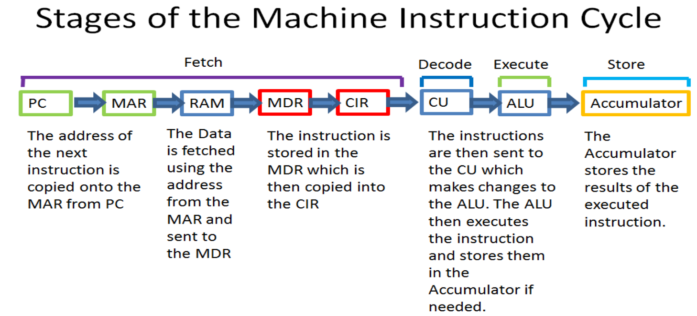

# Interview Preparation for Embedded Systems

## Basics of Computer Architecture

CPU needs it’s own “memory” called Registers. 
Registers are small, very fast circuits that store intermediate
values from calculations or instructions inside the CPU. 
There are many small units, but the four most important ones are the following: 
1. **MAR** is connected to the address bus and contains a memory address.
2. **MDR:** Memory Data Register is connected to the _data bus_ and holds data that will be written to the RAM.
3. **Accumulator** holds the intermediate results of the currently running instructions.
4. **Program Counter** holds the memory address of the next instruction.

**Relationship between MAR & MDR:** The MAR gives the address the data of the MDR will be _read_ from or _written_ to.

**Connections between RAM & CPU**

- **Control Bus**
- **Address Bus**
- **Data Bus**

**Cache Memory:** A type of small, high-speed memory inside the CPU used to hold frequently used data, so that the CPU
needs to access the much slower RAM less frequently.

**Machine Instruction Cycle:**

## Resources
- [Embedded Cheat Sheet](https://docs.google.com/spreadsheets/d/1vXeF-v_mIbnhHQ6Fucws3uBZuSrs6Aa6INtFjsQQweM/edit?usp=sharing)
- [Espressif Systems Interview Experience](https://docs.google.com/document/d/17qRWjSu_LBQzpollnHfa5jAIGB5WApTS756tfdDWuLM/edit?usp=sharing)
