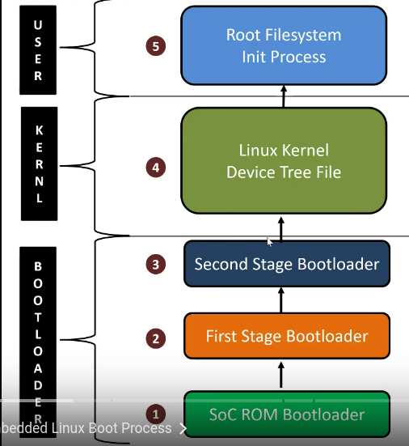

# Interview Preparation for Embedded Systems

## C Programming

**Bitwise operators:**  ``|`` , ``&``, ``^``
refer [this](https://medium.com/techie-delight/bit-manipulation-interview-questions-and-practice-problems-27c0e71412e7) and a few examples are present on the [git repo](https://github.com/DhruvaG2000/embedded-systems-study-group/tree/master/interview-prep/c-programs).

**Compiler options** <br>
Specify the Output Executable Name
``gcc hello.c -o hello.out`` <br>
Enable all warnings set through ``-Wall`` option<br>
Produce only the preprocessor output with ``-E`` option<br>
Produce only the assembly code using ``-S`` option <br>
Produce only the compiled code using the ``-C`` option<br>
Produce all the intermediate files using ``-save-temps`` function.<br> _NOTE:_ Through this option, output at all the stages of compilation is stored in the current directory. Please note that this option produces the executable also.<br>
Link with shared libraries using ``-l`` option<br>
The flag mentioned above links the code with the desired shared library ``libXXX.so``<br>
Create position independent code using ``-fPIC`` option.
position-independent code executes properly regardless of its absolute address.<br>

**extern:** Extern is a keyword in C programming language which is used to declare a global variable that is a variable without any memory assigned to it.<br>
```c
extern <data_type> <variable_name>;
// or
extern <return_type> <function_name>(<parameter_list>);
```

**Pointers**<br>
pointers and integers are not interchangeable, _but_ *Zero* is the sole exception.  


---
## Basics of Computer Architecture

**ELinux Boot process**<br>



- SoC powered up and starts executing at the _reset vector_.
- The SoC ROM bootloader loads the first stage of Bootloader which then copies the 2nd stage of bootloader to the RAM and passes control to it.
- This 2nd stage mainly loads the kernel and device tree into the RAM.
- Then it sets up kernel boot args and then passes control to the kernel which then inits itself and hardware devices.
- The kernel locates the ``/`` fs and mounts it.
- Kernel runs the init process PID0 to start user space.
- This init process then spawns other user space processes based on it's config. <br>


CPU needs it’s own “memory” called Registers.<br>
Registers are small, very fast circuits that store intermediate
values from calculations or instructions inside the CPU.<br>
There are many small units, but the four most important ones are the following:<br>
1. **MAR** is connected to the address bus and contains a memory address.
2. **MDR:** Memory Data Register is connected to the _data bus_ and holds data that will be written to the RAM.
3. **Accumulator** holds the intermediate results of the currently running instructions.
4. **Program Counter** holds the memory address of the next instruction.

**Relationship between MAR & MDR:** The MAR gives the address the data of the MDR will be _read_ from or _written_ to.

**Connections between RAM & CPU**

- **Control Bus**
- **Address Bus**
- **Data Bus**

**Cache Memory:** A type of small, high-speed memory inside the CPU used to hold frequently used data, so that the CPU
needs to access the much slower RAM less frequently.

**Machine Instruction Cycle:**


---
## Basics of Operating System

**Process Schedulers in Operating System**<br>
The process scheduling is the activity of the process manager that handles the removal of the running process from the CPU and the selection of another process on the basis of a particular strategy.<br>
three types of process scheduler:<br>
1. Long Term/ Job scheduler: It increases efficiency by balancing the time spent in i/o processes and CPU cound processes.
2. Short term or CPU scheduler: is responsible for ensuring there is no starvation owing to high burst time processes. *It does not load the process on running*
3. Medium-term scheduler: responsible for suspending and resuming the process.

**threads** are lightweight processes and form basic unit of CPU util. A process can perform more than one task at a time by including several threads.
- It has it's own register, stack, program counter.
- It shares resources with other threads of the same process the code section, data section, files and signals.

There are 2 ype of threads. _User_ and _kernel_ threads. ([ref this](https://www.geeksforgeeks.org/last-minute-notes-operating-systems/?ref=leftbar-rightbar)) <br>

**Process** is a program under execution. The value of PR indicates the address of next instruction. Each process is represented by a PCB (Process Control Block).<br>
**Times wrt process:**
-  *Arrival Time* – Time at which the process arrives in the ready queue.
- *Completion Time* – Time at which process completes its execution
- Burst Time – Time required by a process for CPU execution
- Turn Around Time – Time Difference between completion time and arrival time
- Waiting Time (WT) – Time Difference between turn around time and burst time

**Different Scheduling Algorithms:**
1. FCFS: As name suggests, schedules as and when process arrives.
2. Shortest Job First: shortest burst time are exec first.
3. Shortest Remaining Time first.
4. Round Robin Scheduling: Each process has fixed time, in cyclic manner.
5. Priority Based Scheduling.
6. Highest Response Ratio next: ``Response Ratio = (Waiting Time + Burst time) / Burst time``
7. MultiLevel queue Scheduling. Acc to priority, processes are placed in queues. High prioirty at top of Q, and then lower priority.
8. Multilevel Feedback Q: allows process to move between Q's. If process use too much CPU time it move to lower priority Q.

**Mutual Exclusion** person goes into room locks himself does work then unlocks and then only next person allowed to enter. Process is the person here.

**Deadlock** when processes crowd and fight with each other for resources that are occupied by some other processes, a deadlock occurs. It happens due to:-
- Mutual Exclusion: 1 or more than one resource are non-shareable.
- process holds resources and wait for other resources.
- No Preemption.
- circular wait- processes waiting for each other in circular form.


***Misc notes:***
potential questions for interview:<br>
Comp. arch. :-
1. Why bootloader is needed to load kernel, complete process.
2. diff general purpose OS and embedded os.
3. why embedded linux is different.
*Ans:* The desktop operating system has access to more processor, RAM, storage, ports, and direct human input devices than most micro-controllers. As a result, desktop operating systems also use colorful graphics, photographs, and animations to communicate operations to human users.

OS :-
1. scheduler.
2. how drivers are written

## Resources
- [Embedded Cheat Sheet](https://docs.google.com/spreadsheets/d/1vXeF-v_mIbnhHQ6Fucws3uBZuSrs6Aa6INtFjsQQweM/edit?usp=sharing)
- [Espressif Systems Interview Experience](https://docs.google.com/document/d/17qRWjSu_LBQzpollnHfa5jAIGB5WApTS756tfdDWuLM/edit?usp=sharing)
- [extern in c](https://iq.opengenus.org/extern-in-c/)
- [how to C libraries](https://www.cs.swarthmore.edu/~newhall/unixhelp/howto_C_libraries.html)
